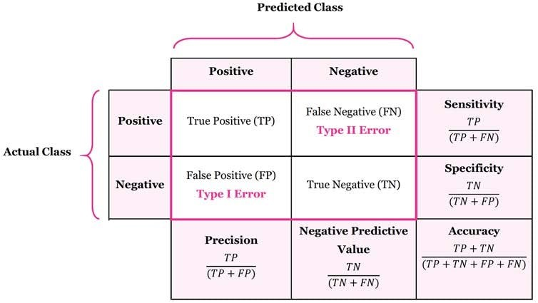

## ISO 25000-Series Software Quality Standards{#sec-iso-25000-overview}

The ISO 25000 series of standards defines software quality characteristics and sub-characteristics. These characteristics can be used to evaluate the quality of software, including AI systems. The main characteristics include:

- **Functional suitability**: The degree to which the software meets the specified requirements and performs its intended functions.

- **Performance efficiency**: The degree to which the software performs its functions efficiently, including response time, resource utilization, and throughput.

- **Compatibility**: The degree to which the software can operate with other software, hardware, or systems.

- **Usability**: The degree to which the software can be used by specified users to achieve specified goals with effectiveness, efficiency, and satisfaction.

- **Reliability**: The degree to which the software can maintain its performance under specified conditions for a specified period of time.

- **Security**: The degree to which the software protects information and data from unauthorized access, use, disclosure, disruption, modification, or destruction.

- **Maintainability**: The degree to which the software can be modified to correct faults, improve performance, or adapt to a changed environment.

### ISO 25059:2023 - Quality Model for AI-Based Systems
The ISO/IEC 25059:2023 standard extends the ISO 25000 series to specifically address the quality characteristics of AI-based systems. It introduces new and partially adapt existing characteristics and sub-characteristics that are relevant to AI, such as AI functional correctness, functional adaptability, user controllability, transparency, AI robustness, and intervenability. Additionally, it emphasizes the importance of societal and ethical risk mitigation in the context of AI systems. Major AI safety challenges, such as vague specifications, non-determinism, self-learning, limited explainability, and evolving standards, are also addressed, with an emphasis on their impact on testing and regulation. This standard provides a framework for evaluating the quality of AI-based systems and can guide the development and testing processes to ensure that these systems meet the necessary quality standards.

### AI-Specific Quality Characteristics 

The ISO/IEC 25059 proposes to evaluate AI-based systems
from two perspectives: product quality and quality in use. From a testing perspective, these quality characteristics directly influence how test objectives are defined, how acceptance criteria are formulated,
and how test results are interpreted for AI-based systems. 

New and modified characteristics, compared to ISO/IEC 25010, include:

- AI functional correctness (product quality): AI-based
  systems, especially those using probabilistic ML, cannot guarantee
  perfect accuracy. Since a certain error rate is expected in AI
  outputs, the concept of functional correctness has been adjusted
  accordingly. ISO/IEC 25059 evaluates functional correctness by
  considering both correct and incorrect outputs and by defining
  acceptable thresholds for incorrect results, reflecting the inherent
  variability in AI-based system outputs (see @sec-metrics-for-classification).

- Functional adaptability (product quality): a new
  sub-characteristic of functional suitability. The ability of the
  AI-based system to autonomously adapt to changes in its operational
  environment after it is deployed.

- User controllability (product quality): a new
  sub-characteristic of interaction capability (note that interaction
  capability is itself a new term that replaces usability in the 2023
  version of ISO/IEC 25010). A property of an AI-based system such that
  a human or another external agent can intervene in its functioning in
  a timely manner.

- Transparency
  (product quality and quality in use): a new sub-characteristic of
  interaction capability and a new sub-characteristic of satisfaction.
  It relates to the degree to which appropriate information about the
  AI-based system is communicated to stakeholders (see 6.1.2).

- AI robustness
  (product quality): a new sub-characteristic of reliability. It
  describes the ability of an AI-based system to maintain its level of
  AI functional correctness regardless of circumstances, such as the
  presence of biased, adversarial, or invalid data inputs, external
  interference, adverse environmental conditions, and operator misuse.

- Intervenability
  (product quality): a new sub-characteristic of security. The degree to
  which an operator can intervene in an AI-based system’s functioning in
  a timely manner to prevent harm or hazard.

- Societal and ethical risk mitigation (quality in use):
  a new sub-characteristic of ‘Freedom from risk’. Considers many areas
  to mitigate societal and ethical risk, including accountability,
  fairness and non-discrimination, professional responsibility,
  promotion of human values, privacy, safety and security, human control
  of technology, community involvement and development, human-centered
  design, respect for the rule of law, respect for international norms
  of behavior, environmental sustainability, and labor practices.

### AI and Safety

Safety-related systems have the potential to cause injury or harm to
people, property or the environment. Developing and testing non-AI
safety-related systems can take a lot of effort, but is feasible;
however, for AI-based systems, there are several additional challenges:

- Specifications: In traditional safety-related systems, requirements
  are defined for the complete system and refined until the developer
  can transform them into code. The requirements for many AI-based
  systems often begin with vague goals and are then implicitly provided
  via the training data that encodes patterns, rules, and objectives,
  without fully formalizing every detail upfront. This can mean that the
  necessary traceability from requirements to implementation is
  inadequate for AI-based systems.

- Non-determinism:
  This characteristic of many AI-based systems makes it inherently
  challenging to guarantee the precise behavior of these systems. Even
  rigorously tested models can exhibit unexpected behavior due to
  factors such as random number generation or slight variations in input
  values.

- Self-learning:
  Rigorous testing is used to demonstrate the safety integrity of a
  system before deployment. For self-learning AI-based systems, this is
  undermined as the system’s behavior progressively moves away from the
  originally tested behavior. Managing how the model learns and the data
  it uses can sometimes help to avoid the emergence of new problematic
  behaviors. Alternatively, safety guards can be implemented to help
  prevent the model from learning or making decisions that could
  compromise safety (e.g., a content moderation component to filter
  prompts).

- Explainability
  and Transparency:
  For safety-related systems, it is essential to understand how and why
  the system makes decisions. However, the decision-making processes of
  AI-based systems are often not transparent. Explainable AI techniques,
  such as LIME (Local interpretable model-agnostic explanations), can
  provide insights into the AI-based system's reasoning; however, they
  are not widely available and may compromise system performance.

- Evolving Regulations: The regulatory landscape for safety-related
  AI-based systems is constantly evolving. The use of AI is currently
  not included in mature functional safety international standards, and
  some of these standards even prohibit its use in such systems. The EU
  AI Act \[EU AI Act\] (see 1.1.8) classifies AI systems used as safety
  components (such as in aviation, medical devices, or automotive) as
  high-risk and imposes strict requirements on their development and
  testing.

## Acceptance Criteria for AI-Based Systems

This section outlines acceptance criteria related to the quality
characteristics specified in the ISO/IEC 25059 standard, as well as
safety. For AI-based systems, acceptance criteria often need to be
statistical, probabilistic, or threshold-based rather than binary, which
introduces additional testing challenges.

When evaluating the quality of an AI-based system, it is essential to
consider both functional and non-functional quality characteristics.
This helps confirm that the AI-based system functions as intended and
satisfies broader quality requirements. The ISO/IEC 25010 and ISO/IEC
25059 standards provide a comprehensive framework for defining software
quality. In this section, the focus is on the acceptance criteria
associated with the quality characteristics specific to AI (i.e., those
defined in ISO/IEC 25059) and safety (see 2.1.2).

The following table lists example acceptance criteria for safety and
each of the quality characteristics defined in the ISO/IEC 25059
standard.

<table>
<colgroup>
<col style="width: 20%" />
<col style="width: 79%" />
</colgroup>
<thead>
<tr>
<th><blockquote>

<strong>Characteristic</strong>

</blockquote></th>
<th><strong>Example Acceptance Criteria</strong></th>
</tr>
</thead>
<tbody>
<tr>
<td><blockquote>

AI functional correctness (see @sec-metrics-for-classification)

</blockquote></td>
<td><ul>
<li>
Accuracy of 95% for an image recognition system.
</li>
<li>
Recall of 90% for a defect prediction system.
</li>
</ul></td>
</tr>
<tr>
<td><blockquote>

Functional adaptability

</blockquote></td>
<td><ul>
<li>
A maximum of 20 seconds for the engine management system to adapt
when it crosses a specified altitude threshold.
</li>
<li>
A video streaming service shall adjust its homepage to recommend
at least 40% of documentaries after a user watches three full-length
documentaries in a single session.
</li>
</ul></td>
</tr>
<tr>
<td><blockquote>

User controllability

</blockquote></td>
<td><ul>
<li>
A supervisor can take control of an autonomous drone within 0.5
of a second when it sends a distress signal due to loss of its GPS
location.
</li>
<li>
The farm control system notifies the farmer when the sensor’s
visual performance degrades by more than 30%, allowing immediate manual
override; it fully deactivates if degradation exceeds 50% without user
response.
</li>
</ul></td>
</tr>
<tr>
<td><blockquote>

Transparency

</blockquote></td>
<td><ul>
<li>
Sufficient information is provided about the third-party ML model
and the provenance of its training data to meet the requirements of the
relevant company standard.
</li>
<li>
The system’s operational dashboard and API must provide an
endpoint that returns the unique version identifier of the currently
deployed prediction model and a link to its corresponding
documentation.
</li>
</ul></td>
</tr>
<tr>
<td><blockquote>

AI robustness

</blockquote></td>
<td><ul>
<li>
The response time for the AI-based security penetration alert
system predictions remains below 1 second when access to the central
vulnerabilities database is disrupted for 30 seconds.
</li>
<li>
The edge AI device shall automatically transition to a
lower-fidelity, reduced-power inference mode (instead of crashing) when
its internal operating temperature exceeds 85°C for a continuous period
of 10 seconds.
</li>
</ul></td>
</tr>
<tr>
<td><blockquote>

Intervenability

</blockquote></td>
<td><ul>
<li>
If a robot breaches its safety zone, the production line is
capable of being shut down within 0.5 seconds after a shutdown is
initiated.
</li>
<li>
To prevent potential blackouts, the power grid management system
shall provide a 30-second confirmation window, during which an engineer
can veto any AI-proposed action classified as 'critical' before it is
automatically executed.
</li>
</ul></td>
</tr>
<tr>
<td><blockquote>

Societal and ethical risk mitigation

</blockquote></td>
<td><ul>
<li>
The automated prison sentencing system does not discriminate
between racial groups based on the specified fairness metric.
</li>
<li>
The chatbot must pass an internal "red teaming" assessment with a
score of 95% or higher, demonstrating its refusal to generate content
that promotes violence, self-harm, or hate speech.
</li>
</ul></td>
</tr>
<tr>
<td><blockquote>

Safety

</blockquote></td>
<td><ul>
<li>
Non-AI components of the AI-based steering control system are
compliant with ISO 26262-6 at ASIL (automotive safety integrity level)
C.
</li>
<li>
100% of the relationships between inputs and outputs of the ML
model in the nuclear power plant control system can be mapped with an
average accuracy of no lower than 99.9% by an explainability
tool.
</li>
<li>
Control signals that exceed specified safety limits by more than
10% are analyzed and regulated within 0.15 seconds after being detected
by the safety monitoring sub-system.
</li>
</ul></td>
</tr>
</tbody>
</table>

# Detailed Preview on ISO/IEC DIS 25059:2026 {#sec-iso-25059-preview}

This document was prepared by Joint Technical Committee ISO/IEC JTC 1,
*Information technology*, Subcommittee SC 42, *Artificial intelligence*.

This second edition cancels and replaces the first edition ([<u>ISO/IEC
25059
:2023</u>](https://www.iso.org/obp/ui/#iso:std:iso-iec:25059:ed-1:v1:en)),
which has been technically revised.

The main changes are as follows:

- — alignment with the revised version of
  [<u>ISO/IEC 25010:2023</u>](https://www.iso.org/obp/ui/#iso:std:iso-iec:25010:ed-2:v1:en);

- — alignment with the revised version of
  [<u>ISO/IEC 25019:2023</u>](https://www.iso.org/obp/ui/#iso:std:iso-iec:25019:ed-1:v1:en);

- — addition of an **AI service quality model** based on [<u>ISO/IEC TS
  25011:2017</u>](https://www.iso.org/obp/ui/#iso:std:iso-iec:ts:25011:ed-1:v2:en);

- — addition of **“Environmental sustainability”** as a
  sub-characteristic of “Performance efficiency” in the product quality
  model.

**2   Normative references**

The following documents are referred to in the text in such a way that
some or all of their content constitutes requirements of this document.
For dated references, only the edition cited applies. For undated
references, the latest edition of the referenced document (including any
amendments) applies.

- [<u>ISO/IEC 25010:2023</u>](https://www.iso.org/obp/ui/#iso:std:iso-iec:25010:ed-2:v1:en)
  Systems and software engineering — Systems and software Quality
  Requirements and Evaluation (SQuaRE) — Product quality model

- [<u>ISO/IEC 25019:2023</u>](https://www.iso.org/obp/ui/#iso:std:iso-iec:25019:ed-1:v1:en)
  Systems and software engineering — Systems and software Quality
  Requirements and Evaluation (SQuaRE) — Quality-in-use model

- [<u>ISO/IEC 22989:2022</u>](https://www.iso.org/obp/ui/#iso:std:iso-iec:22989:ed-1:v1:en)
  Information technology — Artificial intelligence — Artificial
  intelligence concepts and terminology

- [<u>ISO/IEC 23053:2022</u>](https://www.iso.org/obp/ui/#iso:std:iso-iec:23053:ed-1:v1:en)
  Framework for Artificial Intelligence (AI) Systems Using Machine
  Learning (ML)

## 5 Product quality model

An AI system product quality model is detailed in Table 1. The model is
based on a modified version of a general system model provided in
ISO/IEC 25010. New and modified sub-characteristics are identified using
a lettered footnote. Some of the sub-characteristics have different
meanings or contexts as compared to the ISO/IEC 25010 model. The
modifications, additions and differences are described in this clause.

The unmodified original characteristics are part of the AI system
product model and shall be interpreted in accordance with ISO/IEC 25010.
Each of these modified or added sub-characteristics are listed in the
remainder of this clause.

Table 1 — AI system product quality model

<table>
<colgroup>
<col style="width: 50%" />
<col style="width: 50%" />
</colgroup>
<thead>
<tr>
<th><strong>Functional suitability</strong></th>
<th><strong>Security</strong></th>
</thead>
<tbody>
<td>

Functional completeness

</td>
<td>Confidentiality</td>
</tr>
<tr>
<td>

<mark>Functional correctness m</mark>

</td>
<td>Integrity</td>
</tr>
<tr>
<td>

Functional appropriateness

</td>
<td>Non-repudiation</td>
</tr>
<tr>
<td>

<mark>Functional adaptability a</mark>

</td>
<td>Accountability</td>
</tr>
<tr>
<td><strong>Performance efficiency</strong></td>
<td>Authenticity</td>
</tr>
<tr>
<td>Time behaviour</td>
<td>Resistance</td>
</tr>
<tr>
<td>Resource utilization</td>
<td><mark>Intervenability a</mark></td>
</tr>
<tr>
<td>Capacity</td>
<td><strong>Maintainability</strong></td>
</tr>
<tr>
<td><mark>Environmental sustainability a</mark></td>
<td>

Modularity

</td>
</tr>
<tr>
<td><strong>Interaction capability</strong></td>
<td>

Reusability

</td>
</tr>
<tr>
<td>Appropriateness recognisability</td>
<td>

Analysability

</td>
</tr>
<tr>
<td>Learnability</td>
<td>

Modifiability

</td>
</tr>
<tr>
<td>Operability</td>
<td><strong>Flexibility</strong></td>
</tr>
<tr>
<td>User error protection</td>
<td>Testability</td>
</tr>
<tr>
<td>User engagement</td>
<td>Adaptability</td>
</tr>
<tr>
<td>Inclusivity</td>
<td>Scalability</td>
</tr>
<tr>
<td>User assistance</td>
<td>Installability</td>
</tr>
<tr>
<td>Self descriptiveness</td>
<td>Replaceability</td>
</tr>
<tr>
<td><mark>User controllability a</mark></td>
<td><strong>Safety</strong></td>
</tr>
<tr>
<td><mark>Transparency a</mark></td>
<td>Operational constraint</td>
</tr>
<tr>
<td><strong>Reliability</strong></td>
<td>Risk identification</td>
</tr>
<tr>
<td>Faultlessness</td>
<td>Fail safe</td>
</tr>
<tr>
<td>Availability</td>
<td>Hazard warning</td>
</tr>
<tr>
<td>Fault tolerance</td>
<td>Safe integration</td>
</tr>
<tr>
<td>Recoverability</td>
<td><strong>Compatibility</strong></td>
</tr>
<tr>
<td><mark>Robustness a</mark></td>
<td>Co-existence</td>
</tr>
<tr>
<td></td>
<td>Interoperability</td>
</tr>
</tbody>
</table>

NOTE

a Added sub-characteristics.

m Modified sub-characteristics.

**3.2 Product quality**

**3.2.1 user controllability**

degree to which a user can appropriately intervene in an AI system’s
functioning in a timely manner

**3.2.2 functional adaptability**

degree to which an AI system can accurately acquire information from
data, or the result of previous actions, and use that information in
future predictions

**3.2.3 functional correctness**

degree to which a product or system provides the correct results with
the needed degree of precision Note 1 to entry: AI systems, and
particularly those using machine learning models, do not usually provide
functional correctness in all observed circumstances.

\[SOURCE: ISO/IEC 25010:2023, 4.2.1.2, modified — Note to entry
replaced.\]

**3.2.4 intervenability**

degree to which an operator can intervene in an AI system’s functioning
in a timely manner to prevent harm or hazard

**3.2.5 robustness**

degree to which an AI system can maintain its level of functional
correctness under any circumstances

**3.2.6 environmental sustainability**

state in which the ecosystem and its functions are maintained for the
present and future generations

\[SOURCE: ISO 17889-1:2021, 3.1.1, modified — generation made plural.\]

**Added / Modified Subcharacteristics**

**5.4 Functional correctness**

Functional correctness exists in ISO/IEC 25010. The AI system product
quality model amends the description since AI systems, and particularly
probabilistic ML methods, do not usually provide functional correctness
because a certain error rate is expected in their outputs. Therefore, it
is necessary to measure correctness and incorrectness carefully.
Numerous measurements exist for these purposes in the context of ML
methods and examples of these as applicable to a classification model
can be found in ISO/IEC 4213.

Additionally, there can be a trade-off between characteristics such as
performance efficiency\[37\], robustness\[38\] and functional
correctness.

Annex C provides further information about why functional correctness is
preferred to other terms such as the more general performance to
describe the correctness of the model.

**5.3 Functional adaptability**

Functional adaptability is a new sub-characteristic of functional
suitability. Functional adaptability of an

AI system is the ability of the system to adapt itself to a changing
dynamic environment it is deployed in.

AI systems can learn from new training data, production data and the
results of previous actions taken

by the system. The concept of functional adaptability subsumes that of
continuous learning, as defined in ISO/IEC 22989:2022, 5.11.9.2.

Continuous learning is not a mandatory requirement for functional
adaptability. For example, a system

that switches classification models based on events in its environment
can also be considered functionally adaptive.

Functional adaptability in AI systems is unlike other quality
characteristics as there are system specific consequences that cannot be
interpreted using a straight-line linear scale (e.g. bad to good).
Generally, higher functional adaptability can result in improvements for
the outcomes enacted by AI systems.

For some systems, high functional adaptability can cause additional
unhelpful outcomes to become more likely based on the system’s previous
choices. Weightings of a decision path with relatively high uncertainty,
reinforced based on previous AI system decisions, can result in higher
likelihood of unintended negative outcomes. In this fashion, functional
adaptability can reinforce negative human cognitive biases.

While conventional algorithms usually produce the same result for the
same set of inputs, AI systems, due to continuous learning, can exhibit
different behaviour and therefore can produce different results.

**5.8 Environmental sustainability**

The sustainability domain requires organization to consider three main
areas, each with their own sustainability aspects:

— economic sustainability;

— social sustainability;

— environmental sustainability.

To date, the focus of AI practitioners has been mostly on environmental
and social sustainability. Social sustainability is addressed in AI
trustworthiness standards ISO 26000, ISO/IEC TR 24368, ISO/IEC TS 12791
and ISO/IEC 12792.

The environmental sustainability of AI systems affects many ecosystems
in a complex manner. Organizations are only at the beginning of fully
understanding and addressing these environmental sustainability aspects.

The environmental sustainability of AI is an emerging discipline.
However, practitioners can find guidance with regards to the
environmental sustainability of AI applications, AI ecosystems and the
AI system lifecycle, as well as metrics to measure and manage certain
aspects thereof, in the following standards:

— environmental sustainability aspects of AI systems, including ISO/IEC
TR 20226;

— the life cycle assessment of an AI system, including ISO 14040, EC JRC
life cycle assessment;

— methods for measuring resource usage, including software
carbon-intensity, water usage, and energy usage, including ISO/IEC
21031;

— environmental management, including ISO 14001;

— methods for measuring and assessing the environmental impact of an AI
system (including greenhouse gas emissions), including ISO 14064-1,
ISO/IEC 21031, IEEE 1922.2, ITU-T L.1480;

— methods for a circular economy, including ISO 59020.

Depending on the stakeholder role of the user applying these standards,
as well as the phase of the AI system lifecycle in which the standard is
applied, what they measure will vary on a case-by-case basis. For
example, a designer for an AI application can include requirements for
software carbon intensity (SCI) as discovered through ISO/IEC TR 20226,
a developer may implement it using ISO/IEC 21031, and an organization
using the AI application can use the output of the metric in its
greenhouse gas emission reporting.

ISO/IEC TR 20226 describes environmental sustainability aspects of AI
systems.

**5.6 Transparency**

Transparency is sub-characteristic of interaction capability in the
product quality model and a subcharacteristic of satisfaction in the
quality in use model. It relates to the degree to which appropriate
information about the AI system is communicated to stakeholders (see
ISO/IEC 22989:2022, 5.15.8).

Transparency of AI systems can help potential users of AI systems to
choose a system to fit their requirements, improving stakeholders’
knowledge about the applicability and the limitations of an AI system,
and assisting with the explainability of AI systems.

The transparency information can include a description of an AI system
functionality, the system’s decomposition, interfaces, ML models used,
training data, verification and validation data, performance benchmarks,
logs and the management practices of an organization responsible for the
system.

Transparent AI systems document, log or display their internal processes
using introspection tools and data files. The flow of data can be
trackable at each step, with applied decisions, exceptions and rules
documented. Log output can track processes in the pipeline as they
permute data, as well as system level calls. Errors are logged
explicitly, particularly in transform steps. Highly transparent AI
systems can be built of well-documented subcomponents whose interfaces
are explicitly described. The transparency of AI systems eases
investigations of system malfunctions.

A system with low transparency has internal workings which are difficult
to inspect externally. Unavailability of detailed processing records can
impair testability and societal and ethical impact assessment and risk
treatment.

Ultimately, transparency of AI systems contributes to establishing of
trust, accountability and communication among stakeholders. Some aspects
of transparency are discussed in ISO/IEC 12792 and ISO/IEC TS 6254.

**5.5 Robustness**

Robustness is a new sub-characteristic of reliability. It is used to
describe the ability of a system to maintain its level of functional
correctness (see Annex C for discussion on the term performance) under
any circumstances including:

— the presence of unseen, biased, adversarial or invalid data inputs;

— external interference;

— environmental conditions encompassing generalization, resilience,
reliability;

— attributes related to the proper operation of the system as intended
by its developers.

The proper operation of a system is important for the security of the
system and safety of its stakeholders in a given environment or context.
Information about functional safety in the context of AI systems can be
found in the ISO/IEC TS 22440 series (ISO/IEC TS 22440-1, ISO/IEC TS
22440-2 and ISO/IEC TS 22440-3).

Robustness is discussed in ISO/IEC TR 24028:2020, 10.7 and methods for
assessment are described in ISO/IEC TR 24029-1 and defined in the
ISO/IEC 24029 series (ISO/IEC 24029-2 and ISO/IEC 24029-3).

**5.7 Intervenability**

The extent of intervenability can be determined depending on the scenarios where the AI system can be
used. The key to intervenability is to enable state observation and transition from an unsafe state to a safe state. Operability is the degree to which an AI system has attributes that enable operation and control, which emphasizes the importance of an AI system’s user interface. Compared to operability, intervenability is more fundamental from a quality perspective and is intended to prevent an AI
system from doing harm or hazard.

Intervenability is related to controllability, which is described in ISO/IEC TS 8200 and ISO/IEC 22989:2022, 5.15.5.

## Quality-in-use model

**General**

An AI system quality-in-use model is detailed in Table 2. The model is
based on a modified version of a general quality-in-use model provided
in ISO/IEC 25019. New sub-characteristics are identified using a
lettered footnote. Some of the sub-characteristics have different
meanings or contexts as compared to the ISO/IEC 25019 model. The
additions and differences are described in this clause. The unmodified
characteristics are part of the quality-in-use model and shall be
interpreted as defined in ISO/IEC 25019.

Table 2 — AI system quality-in-use model

<table>
<colgroup>
<col style="width: 50%" />
<col style="width: 50%" />
</colgroup>
<thead>
<tr>
<th><strong>Beneficialness</strong></th>
<th><strong>Risk mitigation</strong></th>
</tr>
</thead>
<tbody>
<tr>
<td>Usability</td>
<td>Economic risk mitigation</td>
</tr>
<tr>
<td>Accessibility</td>
<td><mark>Environmental risk mitigation a</mark></td>
</tr>
<tr>
<td>Suitability</td>
<td><mark>Societal and ethical risk mitigation a</mark></td>
</tr>
<tr>
<td><strong>Acceptability</strong></td>
<td>Health risk mitigation -&gt; <mark>25019</mark></td>
</tr>
<tr>
<td>Experience</td>
<td>Human life risk mitigation</td>
</tr>
<tr>
<td>Trustworthiness</td>
<td></td>
</tr>
<tr>
<td>Compliance</td>
<td></td>
</tr>
<tr>
<td><mark>Transparency a</mark></td>
<td></td>
</tr>
</tbody>
</table>

NOTE

a Added sub-characteristics

**6.2 Transparency**

Transparency is also a sub-characteristic of satisfaction in the product
quality model. See 5.6 for further information.

**Environmental risk mitigation**

degree to which a product or system mitigates the potential risk to the environment in the intended contexts of use

Note 1 to entry: environmental risk mitigation includes the mitigation
of risks that could harm the environment, such as pollution, waste, and
resource depletion. Additionally, it involves the product or system’s
role in sustainability through the efficient utilization of resources,
reduction of waste, and facilitation of recycling and reuse processes.

**freedom from environmental and societal risk**

extent to which a product (3.1.14) or system (3.1.29) mitigates the
potential risk (3.1.22) to the environment and society (3.1.23) at large
in the intended contexts of use (3.1.4)

Note 1 to entry: When a product or system is especially recognized as an
information system (3.1.9) and IT service, there is concern the
environmental and societal risk impacts on public properties in
societies, and on environments including societal or natural ecology
systems in a diverse and broad group of stakeholders (3.1.26) so that
the risk monitoring used is often considered to be more focused in
addition to risk mitigation.

**6.3 Societal and ethical risk mitigation**

Societal and ethical risk mitigation is a new sub-characteristic of risk
mitigation. ISO/IEC TS 22443 explores this topic and outlines the
following themes:

— accountability;

— fairness and non-discrimination;

— transparency and explainability;

— professional responsibility;

— promotion of human values;

— privacy;

— safety and security;

— human control of technology;

— community involvement and development;

— human-centred design;

— respect for the rule of law;

— respect for international norms of behaviour;

— environmental sustainability;

— labour practices.

These themes should be considered along with the information in
**ISO/IEC TS 22443**0F[1], with regard to the desirable characteristics
of systems in order to mitigate societal and ethical risk.

Safety and security as well as sustainable environments are included
within the existing SQuaRE characteristics health and safety risk
mitigation, and environment risk mitigation, and therefore are not
outlined in this document.

**freedom from health risk**
extent to which a product (3.1.14) or system (3.1.29) mitigates the
potential risk (3.1.22) to people’s health in the intended contexts of
use (3.1.4) (from ISO 25019: Quality in Use Model: 3.2.2.3**
)

**freedom from human life risk**

extent to which a product (3.1.14) or system (3.1.29) mitigates the
potential risk (3.1.22) to people’s lives in the intended contexts of
use (3.1.4)

## 7 AI service quality model

**7.1 General**

An AI service quality model is detailed in Table 3. The model is based
on a modified version of IT service quality model provided in ISO/IEC TS
25011. New and modified sub-characteristics are identified using a
lettered footnote. Some of the sub-characteristics have different
meanings or contexts as compared to the ISO/IEC TS 25011 model. The
modifications, additions and differences are described in this clause.
The unmodified original characteristics are part of the IT service
quality model and shall be interpreted in accordance with ISO/IEC TS
25011.

Table 3 — AI service quality model 
<table>
<colgroup>
<col style="width: 50%" />
<col style="width: 50%" />
</colgroup>
<thead>
<tr>
<th><strong>Service quality</strong></th>
<th><strong>Service risk mitigation</strong></th>
</tr>
</thead>
<tbody>
<tr>
<td>Service performance</td>
<td>Service safety risk mitigation</td>
</tr>
<tr>
<td>Service reliability</td>
<td>Service security risk mitigation</td>
</tr>
<tr>
<td>Service availability</td>
<td>Service societal and ethical risk mitigation</td>
</tr>
<tr>
<td><mark>Traceability a</mark></td>
<td></td>
</tr>
<tr>
<td><mark>Service adaptability a</mark></td>
<td></td>
</tr>
<tr>
<td><mark>Customizability a</mark></td>
<td></td>
</tr>
</tbody>
</table>  

**3.4.1 traceability**

degree to which the AI service outcomes can be traced to or from the
user needs

**3.4.2 service adaptability**

degree to which a service can be adapted based on factors such as
functions, responsibility, skill of

employees, communication style with users or instruments available

**3.4.3 customizability**

degree to which the AI service can be customized at the request of users

**7.2 Traceability**

Traceability is a sub-characteristic of security. Traceability of AI
systems includes proper logging and record keeping of models, data sets,
requests and outcomes. For more information, refer to ISO/IEC 24970.

**7.3 Service adaptability**

Service adaptability is a characteristic of the AI service quality
model. Service adaptability is influenced by digital instruments and
analysis of digital transformation. Some suggestions and improvements
can be derived from the introduction of AI systems.

Some adaptations can benefit optimizing interoperability of services,
reduction of duplications, clarifying and adapting responsibilities of
management and leadership.

Introducing measurements of efficiency and effectiveness of services can
suggest further actions of adaptability.

**7.4 Customizability**

Customizability is a sub-characteristic of service adaptability. The
data quality and data quantity are

examples of constraints that need to be taken into consideration when customizing an AI system.

# ISO/IEC TS 4213:2022 Information technology — Artificial intelligence — Assessment of machine learning classification performance

[Lokale
Version](../SomePDFs/NormenStandards/DIN_ISO_IEC/ISO-IEC%20TS%204213_2022-10-00_EN_3394456%20Assessment%20of%20ML%20classification%20performancePDF24.pdf)

**Contents**

Foreword....v

Introduction....vi

1 Scope....1

2 Normative references...1

3 Terms and definitions...1

3.1 Classification and related terms...1

3.2 Metrics and related terms...1

4 Abbreviated terms...3

5 General principles...4

5.1 Generalized process for machine learning classification performance
assessment.4

5.2 Purpose of machine learning classification performance assessment.4

5.3 Control criteria in machine learning classification performance
assessment.5

5.3.1 General...5

5.3.2 Data representativeness and bias..5

5.3.3 Preprocessing...5

5.3.4 Training data...5

5.3.5 Test and validation data...6

5.3.6 Cross-validation...6

5.3.7 Limiting information leakage...6

5.3.8 Limiting channel effects...6

5.3.9 Ground truth...7

5.3.10 Machine learning algorithms, hyperparameters and parameters.7

5.3.11 Evaluation environment...8

5.3.12 Acceleration...8

5.3.13 Appropriate baselines...8

5.3.14 Machine learning classification performance context..8

6 Statistical measures of performance...8

6.1 General....8

6.2 Base elements for metric computation..9

6.2.1 General...9

6.2.2 Confusion matrix...9

6.2.3 Accuracy...9

6.2.4 Precision, recall and specificity..9

6.2.5 F1 score...9

6.2.6 Fβ....9

6.2.7 Kullback-Leibler divergence...10

6.3 Binary classification...10

6.3.1 General...10

6.3.2 Confusion matrix for binary classification..11

6.3.3 Accuracy for binary classification..11

6.3.4 Precision, recall, specificity, F1 score and Fβ for binary
classification.11

6.3.5 Kullback-Leibler divergence for binary classification..11

6.3.6 Receiver operating characteristic curve and area under the
receiver operating characteristic curve..11

6.3.7 Precision recall curve and area under the precision recall
curve.11

6.3.8 Cumulative response curve...12

6.3.9 Lift curve...12

6.4 Multi-class classification...12

6.4.1 General...12

6.4.2 Accuracy for multi-class classification..12

6.4.3 Macro-average, weighted-average and micro-average..12

6.4.4 Distribution difference or distance metrics..13

6.5 Multi-label classification...14

6.5.1 General...14

6.5.2 Hamming loss...14

6.5.3 Exact match ratio...15

6.5.4 Jaccard index...15

6.5.5 Distribution difference or distance metrics..15

6.6 Computational complexity...16

6.6.1 General...16

6.6.2 Classification latency...16

6.6.3 Classification throughput...17

6.6.4 Classification efficiency...17

6.6.5 Energy consumption...17

7 Statistical tests of significance...18

7.1 General....18

7.2 Paired Student’s t-test...18

7.3 Analysis of variance...19

7.4 Kruskal-Wallis test...19

7.5 Chi-squared test...19

7.6 Wilcoxon signed-ranks test...19

7.7 Fisher’s exact test...19

7.8 Central limit theorem...20

7.9 McNemar test...20

7.10 Accommodating multiple comparisons..20

7.10.1 General...20

7.10.2 Bonferroni correction...20

7.10.3 False discovery rate...21

8 Reporting....21

Annex A (informative) Multi-class classification performance
illustration.22

Annex B (informative) Illustration of ROC curve derived from
classification results.24

Annex C (informative) Summary information on machine learning
classification benchmark tests....29

Annex D (informative) Chance-corrected cause-specific mortality
fraction.31

Bibliography....32

# CT-GenAI 2.3.1 Metrics for Evaluating the Results of Generative AI on Test tasks

**\[CT-GenAI 1.1\] p.30f**

Several metrics can be used to evaluate the quality and efficiency of
GenAI results on a test
task:

<table>
<colgroup>
<col style="width: 18%" />
<col style="width: 36%" />
<col style="width: 45%" />
</colgroup>
<thead>
<tr>
<th style="text-align: left;"><strong>Metric</strong></th>
<th style="text-align: left;"><strong>Description</strong></th>
<th style="text-align: left;"><strong>Example (for test generation
task)</strong></th>
</tr>
</thead>
<tbody>
<tr>
<td style="text-align: left;"><strong>Accuracy</strong></td>
<td style="text-align: left;">Measures the overall correctness of the
generated output against expert-written test cases, requirements, or
other standards.</td>
<td style="text-align: left;">The degree to which the generated test
cases cover all specified requirements.</td>
</tr>
<tr>
<td style="text-align: left;"><strong>Precision</strong></td>
<td style="text-align: left;">Evaluates the correctness of the generated
output with respect to a specific objective.</td>
<td style="text-align: left;">The degree to which the generated test
cases correctly identify anomalies.</td>
</tr>
<tr>
<td style="text-align: left;"><strong>Recall</strong></td>
<td style="text-align: left;">Measures the ability of a model to
identify all relevant instances within a dataset.</td>
<td style="text-align: left;">The degree to which generated test cases
cover valid and invalid equivalence partition of a data class.</td>
</tr>
<tr>
<td style="text-align: left;"><strong>Relevance and Contextual
Fit</strong></td>
<td style="text-align: left;">Determines whether the generated output is
applicable and appropriate for a given context.</td>
<td style="text-align: left;">The degree to which the generated test
cases are consistent with the test basis and integrate the
domain-specific requirements.</td>
</tr>
<tr>
<td style="text-align: left;"><strong>Diversity</strong></td>
<td style="text-align: left;">Ensures a wide range of inputs and
scenarios are covered, avoiding repetition.</td>
<td style="text-align: left;">The degree to which the generated test
cases cover various user behaviors and to which they explore edge
cases.</td>
</tr>
<tr>
<td style="text-align: left;"><strong>Execution Success
Rate</strong></td>
<td style="text-align: left;">Measures the proportion of generated
test artifacts that can be fed as is into the test execution environment
without causing errors. </td>
<td style="text-align: left;">Determining how many of the generated test
scripts can be executed without syntax errors or output format issues in
an otherwise working test environment.</td>
</tr>
<tr>
<td style="text-align: left;"><strong>Time Efficiency</strong></td>
<td style="text-align: left;">Evaluates the time saved compared to
manual test efforts.</td>
<td style="text-align: left;">Time required by the AI to generate test
cases versus the time a human would take to manually create equivalent
tests.</td>
</tr>
</tbody>
</table>

In addition to these general metrics, task-specific metrics can be
tailored to evaluate how well the GenAI supports specific test
activities.

To evaluate these metrics effectively, testers may perform manual
reviews or automate them e.g. by comparing the LLM output against a
predefined reference. Given the non-deterministic nature of GenAI, the
metrics must be based on statistically relevant data.

# CT-AI 2.1 Quality Characteristics for AI-Based Systems

\[CT-AI 2.0 Beta\] p 22f

This section covers AI-specific quality characteristics outlined in
ISO/IEC 25059, which extends traditional software quality models to
address unique aspects of AI-based systems. It introduces new and
adapted characteristics including functional correctness, functional
adaptability, user controllability, transparency, robustness, and
intervenability, alongside societal and ethical risk mitigation. Major
AI safety challenges, such as vague specifications, non-determinism,
self-learning, limited explainability, and evolving standards, are also
addressed, with an emphasis on their impact for testing and regulation.

## 2.1.1 AI-Specific Quality Characteristics

ISO/IEC 25059 extends the quality model from ISO/IEC 25010 to address AI-specific considerations. This extension evaluates AI-based systems from two perspectives: product quality and quality in use. New and modified characteristics, compared to ISO/IEC 25010, include:

- **Functional correctness** (product quality): AI-based systems, especially those using probabilistic ML, cannot guarantee perfect accuracy. Since a certain error rate is expected in AI outputs, the concept of functional correctness has been adjusted accordingly. ISO/IEC 25059 expects functional correctness to be measured in terms of both correctness and incorrectness, reflecting the inherent variability in AI-based system outputs (see @sec-metrics-for-classification).

- **Functional adaptability** (product quality): 
  a new sub-characteristic of functional suitability. The ability of the AI-based system to autonomously adapt to changes in its operational
  environment after it is deployed.

- **User controllability** (product quality): 
  a new sub-characteristic of interaction capability (note that interaction capability is itself a new term that replaces usability in the 2023 version of ISO/IEEE 25010). A property of an AI-based system such that a human or another external agent can intervene in its functioning in a timely manner.

- **Transparency** (product quality and quality in use):
  a new sub-characteristic of interaction capability and satisfaction. It relates to the degree to which appropriate information about the AI based system is communicated to stakeholders (see 6.1.2).

- **Robustness** (product quality):
  a new sub-characteristic of reliability. It describes the ability of an AI-based system to regardless of the circumstances, such as the presence of biased, adversarial, or invalid data inputs, external interference, adverse environmental conditions, and operator misuse.

- **Intervenability** (product quality): 
  a new sub-characteristic of security. The degree to which an operator can intervene in an AI-based system’s functioning in a timely manner to prevent harm or hazard.

- **Societal and ethical risk mitigation** (quality in use): 
   a new sub-characteristic of ‘Freedom from risk’. Considers many areas to mitigate societal and ethical risk, including accountability, fairness and non-discrimination, professional responsibility, promotion of human values, privacy, safety and security, human control of technology, community involvement and development, humancentered design, respect for the rule of law, respect for international norms of behavior, environmental sustainability, and labor practices.

## 2.1.2 AI and Safety Challenges

Safety-related systems have the potential to cause injury or harm to people or the environment. Developing and testing non-AI safety-related
systems can take a lot of effort but is feasible; however, for AI-based systems, there are several additional challenges:

**Specifications**: In traditional safety-related systems, requirements are defined for the complete system and refined until the developer can transform them into code. The requirements for many AI-based systems often begin with vague goals and are then implicitly provided via the training data. This can mean that the necessary traceability from requirements to implementation is inadequate for AI-based systems.

**Non-determinism:** This characteristic of many AI-based systems makes it inherently challenging to guarantee the precise behavior of these systems. Even rigorously tested models can exhibit unexpected behavior due to factors such as random number generation or slight variations in input values.

**Self-learning:** Rigorous testing is used to demonstrate the safety integrity of a system before
deployment. For self-learning AI-based systems, this is undermined as the system’s behavior progressively moves away from the originally tested behavior. Managing how the model learns and the data it uses to avoid the emergence of new problematic behaviors
is sometimes possible.

Alternatively, safety guards can be implemented to help prevent the model from learning or making decisions that could compromise safety (e.g. a content moderation module to filter prompts).

**Explainability and Transparency:** For safety-related systems, it is essential to understand how and why the system makes decisions. However, AI-based systems can be opaque in their decision-making process. Explainable AI techniques, such as LIME, can provide insights into the AI-based system's reasoning; however, they are not widely available and can lead to compromises in system performance.

**Evolving Regulations:** The regulatory landscape for safety-related AI-based systems is constantly evolving. The use of AI is currently not included in mature functional safety international 
standards, and some of these standards even prohibit the use of AI in such systems. The EU AI Act \[EU AI Act\] (see 1.1.8) classifies AI systems used as safety
components (such as in aviation, medical devices, or automotive) as high-risk and imposes strict
requirements on their development and testing.

## 2.2.1 Acceptance Criteria for AI-Based Systems

\[CT-AI 2.0 Beta\] p 23f

When evaluating the quality of an AI-based system, it is essential to
consider both functional and nonfunctional quality characteristics. This
ensures that the AI-based system functions as intended and satisfies
broader quality requirements. The ISO/IEC 25010 and ISO/IEC 25059
standards provide a comprehensive framework for defining software
quality. In this section, the focus is on the acceptance criteria
associated with the quality characteristics specific to AI (i.e., those
defined in ISO/IEC 25059) and safety (see 2.1.2).

The following table provides a list of example acceptance criteria for each of the quality characteristics defined in the ISO/IEC 25059
standard, as well as safety.

<table>
<colgroup>
<col style="width: 26%" />
<col style="width: 73%" />
</colgroup>
<thead>
<tr>
<th style="text-align: left;"><strong>Characteristic</strong></th>
<th style="text-align: left;"><strong>Example Acceptance
Criteria</strong></th>
</tr>
</thead>
<tbody>
<tr>
<td style="text-align: left;">Functional correctness</td>
<td><ul>
<li>
Accuracy of 95% for an image recognition system.
</li>
<li>
A recall of 90% for a defect prediction system.
</li>
</ul></td>
</tr>
<tr>
<td style="text-align: left;">Functional adaptability</td>
<td><ul>
<li>
A maximum of 20 seconds for the engine management system to adapt
when it crosses a specified altitude threshold.
</li>
<li>
A video streaming service shall adjust its homepage to feature at
least 40% documentary recommendations after a user watches three
fulllength documentaries in a single session.
</li>
</ul></td>
</tr>
<tr>
<td style="text-align: left;">User controllability</td>
<td><ul>
<li>
A supervisor can take control of an autonomous drone when it
sends a distress signal within 0.5 of a second if it loses its GPS
location.
</li>
<li>
The farm control system deactivates the autonomous weeding system
when the sensor's visual acuity (of the weeding system) has degraded by
more than 50%.
</li>
</ul></td>
</tr>
<tr>
<td style="text-align: left;">Transparency</td>
<td><ul>
<li>
Sufficient information is provided about the third-party ML model
(including the provenance of training data) to meet the requirements of
the relevant standard.
</li>
<li>
The system’s operational dashboard and API must provide an
endpoint that returns the unique version identifier of the currently
deployed prediction model and a link to its corresponding
documentation.
</li>
</ul></td>
</tr>
<tr>
<td style="text-align: left;">Robustness</td>
<td><ul>
<li>
The response time for the AI-based security penetration alert
system predictions remains below 1 second when access to the central
vulnerabilities database is disrupted for 30 seconds.
</li>
<li>
The edge AI device shall automatically transition to a
lower-fidelity, reduced-power inference mode (instead of crashing) when
its internal operating temperature exceeds 85°C for a continuous period
of 10 seconds.
</li>
</ul></td>
</tr>
<tr>
<td style="text-align: left;">Intervenability</td>
<td><ul>
<li>
If a robot breaches its safety zone, the production line is
capable of being shut down within 0.5 seconds once a shut-down is
initiated.
</li>
<li>
The power grid management system shall provide a 30-second
confirmation window, during which an engineer can veto any AI-proposed
action classified as 'critical' before it is automatically executed,
preventing potential blackouts.
</li>
</ul></td>
</tr>
<tr>
<td style="text-align: left;">Societal and ethical risk mitigation</td>
<td><ul>
<li>
The automated prison sentencing system does not discriminate
between racial groups based on the specified fairness metric.
</li>
<li>
The chatbot must pass an internal "red teaming" assessment with a
score of 95% or higher, demonstrating it refuses to generate content
that promotes violence, self-harm, or hate speech.
</li>
</ul></td>
</tr>
<tr>
<td style="text-align: left;">Safety</td>
<td><ul>
<li>
Non-AI components of the AI-based steering control system are
compliant with ISO 26262-6 at ASIL A.
</li>
<li>
100% of the relationships between inputs and outputs of the ML
model in the nuclear control system can be mapped with an average
accuracy of no lower than 99.9% by an explainability tool.
</li>
<li>
Control signals that exceed specified safety limits by more than
10% are analyzed and regulated within 0.15 seconds after being detected
by the safety monitoring sub-system.
</li>
</ul></td>
</tr>
</tbody>
</table>

## Functional Performance Metrics for Classification {#sec-metrics-for-classification}

\[CT-AI 2.0 Beta\] p 33ff

{#fig-quarto fig-alt="Confusion Matrix for binary classification" width="4.53282in" height="3.52113in"}

Based on the confusion matrix, the following metrics are defined:

**- Accuracy** **= (TP + TN) / (TP +TN + FP + FN) \* 100%**

Accuracy measures the percentage of all correct classifications.

**- Precision = TP / (TP + FP) \* 100%**

Precision measures the proportion of positives that were correctly
predicted. It is a measure of how sure about positive predictions one
can be.

**- Recall = TP / (TP + FN) \* 100%**

Recall (also known as sensitivity) measures the proportion of actual
positives that were predicted

correctly. It is a measure of how sure one can be about not missing any
positives.

**- F1-score = 2\* (Precision \* Recall) / (Precision + Recall)**

F1-score is calculated as the harmonic mean of precision and recall,
with values ranging from 0 to 1. A score close to 1 means the model
achieves both high precision and high recall, indicating that false data
(false positives and false negatives) have minimal impact. Conversely, a
low F1-score indicates the model struggles to accurately identify
positives, either missing true cases or generating many false alarms.

# Langfuse Metrics & Dimensions

<https://langfuse.com/?tab=metrics>

## Metrics: 

- **Quality** is measured through

  - user feedback,

  - model-based scoring,

  - human-in-the-loop scored samples or

  - custom scores via SDKs/API (see scores). Quality is assessed over
    time as well as across prompt versions, LLMs and users.

- **Cost and Latency** are accurately measured and broken down by user,
  session, geography, feature, model and prompt version.

- **Volume** based on the ingested traces and tokens used.

## Dimensions:

- **Trace name**: differentiate between different use cases, features,
  etc. by adding a name field to your traces.

- **User**: track usage and cost by user. Just add a userId to your
  traces (docs).

- **Tags**: filter different use cases, features, etc. by adding tags to
  your traces.

- **Release and version numbers**: track how changes to the LLM
  application affected your metrics.

For an exact definition, please refer to the metrics API docs.

# Claude-Search for „LLM Quality metrics in Claude Code“

Aus &lt;<https://code.claude.com/docs/en/analytics>&gt;

Based on the search results, the analytics page covers several LLM
quality metrics for Claude Code:

## Summary metrics

- **Suggestion accept rate**: Percentage of times users accept Claude
  Code's code editing suggestions (Edit, Write, NotebookEdit tools)

- **Lines of code accepted**: Total lines written by Claude Code that
  users accepted

## Contribution metrics (with GitHub integration):

- **PRs with CC**: Merged pull requests containing Claude Code-assisted
  code

- **Lines of code with CC**: Lines across merged PRs written with Claude
  Code assistance (only "effective lines" with &gt;3 characters)

- **PRs with Claude Code (%)**: Percentage of merged PRs containing
  Claude Code-assisted code

These metrics are deliberately conservative—only lines with high
confidence in Claude Code's involvement are counted. The dashboard also
tracks adoption (daily active users, sessions) and PRs per user to
measure productivity changes.

For API customers, the Console dashboard shows

- lines accepted,

- suggestion accept rate,

- activity, and

- spend metrics.

# DeepEval Metrics and Features

Aus
&lt;<https://github.com/confident-ai/deepeval?tab=readme-ov-file#-metrics-and-features>&gt;

- Large variety of ready-to-use LLM eval metrics (all with explanations)
  powered by **ANY** LLM of your choice, statistical methods, or NLP
  models that run **locally on your machine** covering all use cases:

## Custom, All-Purpose Metrics:

- [G-Eval](https://deepeval.com/docs/metrics-llm-evals) — a
  research-backed LLM-as-a-judge metric for evaluating on any custom
  criteria with human-like accuracy

- [DAG](https://deepeval.com/docs/metrics-dag) — DeepEval's graph-based
  deterministic LLM-as-a-judge metric builder

## Agentic Metrics 

- [Task Completion](https://deepeval.com/docs/metrics-task-completion) —
  evaluate whether an agent accomplished its goal

- [Tool Correctness](https://deepeval.com/docs/metrics-tool-correctness)
  — check if the right tools were called with the right arguments

- [Goal Accuracy](https://deepeval.com/docs/metrics-goal-accuracy) —
  measure how accurately the agent achieved the intended goal

- [Step Efficiency](https://deepeval.com/docs/metrics-step-efficiency) —
  evaluate whether the agent took unnecessary steps

- [Plan Adherence](https://deepeval.com/docs/metrics-plan-adherence) —
  check if the agent followed the expected plan

- [Plan Quality](https://deepeval.com/docs/metrics-plan-quality) —
  evaluate the quality of the agent's plan

- [Tool Use](https://deepeval.com/docs/metrics-tool-use) — measure
  quality of tool usage

- [Argument
  Correctness](https://deepeval.com/docs/metrics-argument-correctness) —
  validate tool call arguments

## RAG Metrics 

- [Answer Relevancy](https://deepeval.com/docs/metrics-answer-relevancy)
  — measure how relevant the RAG pipeline's output is to the input

- [Faithfulness](https://deepeval.com/docs/metrics-faithfulness) —
  evaluate whether the RAG pipeline's output factually aligns with the
  retrieval context

- [Contextual
  Recall](https://deepeval.com/docs/metrics-contextual-recall) — measure
  how well the RAG pipeline's retrieval context aligns with the expected
  output

- [Contextual
  Precision](https://deepeval.com/docs/metrics-contextual-precision) —
  evaluate whether relevant nodes in the RAG pipeline's retrieval
  context are ranked higher

- [Contextual
  Relevancy](https://deepeval.com/docs/metrics-contextual-relevancy) —
  measure the overall relevance of the RAG pipeline's retrieval context
  to the input

- [RAGAS](https://deepeval.com/docs/metrics-ragas) — average of answer
  relevancy, faithfulness, contextual precision, and contextual recall

## Multi-Turn Metrics 

- [Knowledge
  Retention](https://deepeval.com/docs/metrics-knowledge-retention) —
  evaluate whether the chatbot retains factual information throughout a
  conversation

- [Conversation
  Completeness](https://deepeval.com/docs/metrics-conversation-completeness)
  — measure whether the chatbot satisfies user needs throughout a
  conversation

- [Turn Relevancy](https://deepeval.com/docs/metrics-turn-relevancy) —
  evaluate whether the chatbot generates consistently relevant responses
  throughout a conversation

- [Turn
  Faithfulness](https://deepeval.com/docs/metrics-turn-faithfulness) —
  check if the chatbot's responses are factually grounded in retrieval
  context across turns

- [Role Adherence](https://deepeval.com/docs/metrics-role-adherence) —
  evaluate whether the chatbot adheres to its assigned role throughout a
  conversation

## MCP Metrics 

- [MCP Task
  Completion](https://deepeval.com/docs/metrics-mcp-task-completion) —
  evaluate how effectively an MCP-based agent accomplishes a task

- [MCP Use](https://deepeval.com/docs/metrics-mcp-use) — measure how
  effectively an agent uses its available MCP servers

- [Multi-Turn MCP
  Use](https://deepeval.com/docs/metrics-multi-turn-mcp-use) — evaluate
  MCP server usage across conversation turns

## Multimodal Metrics 

- [Text to
  Image](https://deepeval.com/docs/multimodal-metrics-text-to-image) —
  evaluate image generation quality based on semantic consistency and
  perceptual quality

- [Image
  Editing](https://deepeval.com/docs/multimodal-metrics-image-editing) —
  evaluate image editing quality based on semantic consistency and
  perceptual quality

- [Image
  Coherence](https://deepeval.com/docs/multimodal-metrics-image-coherence)
  — measure how well images align with their accompanying text

- [Image
  Helpfulness](https://deepeval.com/docs/multimodal-metrics-image-helpfulness)
  — evaluate how effectively images contribute to user comprehension of
  the text

- [Image
  Reference](https://deepeval.com/docs/multimodal-metrics-image-reference)
  — evaluate how accurately images are referred to or explained by
  accompanying text

## Other Metrics 

- [Hallucination](https://deepeval.com/docs/metrics-hallucination) —
  check whether the LLM generates factually correct information against
  provided context

- [Summarization](https://deepeval.com/docs/metrics-summarization) —
  evaluate whether summaries are factually correct and include necessary
  details

- [Bias](https://deepeval.com/docs/metrics-bias) — detect gender,
  racial, or political bias in LLM outputs

- [Toxicity](https://deepeval.com/docs/metrics-toxicity) — evaluate
  toxicity in LLM outputs

- [JSON Correctness](https://deepeval.com/docs/metrics-json-correctness)
  — check whether the output matches an expected JSON schema

- [Prompt Alignment](https://deepeval.com/docs/metrics-prompt-alignment)
  — measure whether the output aligns with instructions in the prompt
  template

# Microsoft Foundry Built-in evaluators reference

Microsoft Foundry provides a comprehensive set of built-in evaluators to
assess the quality, safety, and reliability of AI responses throughout
the development lifecycle. This reference details all available
evaluators, their purposes, required inputs, and guidance on selecting
the right evaluator for your use case. You can also create [custom
evaluators](https://learn.microsoft.com/en-us/azure/foundry/concepts/evaluation-evaluators/custom-evaluators)
tailored to your specific evaluation criteria.1F[2]

## General purpose evaluators

<table>
<colgroup>
<col style="width: 15%" />
<col style="width: 84%" />
</colgroup>
<thead>
<tr>
<th style="text-align: center;"><strong>Evaluator</strong></th>
<th style="text-align: center;"><strong>Purpose</strong></th>
</tr>
</thead>
<tbody>
<tr>
<td style="text-align: left;">Coherence</td>
<td>Measures logical consistency and flow of responses.</td>
</tr>
<tr>
<td style="text-align: left;">Fluency</td>
<td>Measures natural language quality and readability.</td>
</tr>
</tbody>
</table>

To learn more, see [General purpose
evaluators](https://learn.microsoft.com/en-us/azure/foundry/concepts/evaluation-evaluators/general-purpose-evaluators).

## Textual similarity evaluators

<table>
<colgroup>
<col style="width: 15%" />
<col style="width: 84%" />
</colgroup>
<thead>
<tr>
<th style="text-align: center;"><strong>Evaluator</strong></th>
<th style="text-align: center;"><strong>Purpose</strong></th>
</tr>
</thead>
<tbody>
<tr>
<td style="text-align: left;">Similarity</td>
<td>AI-assisted textual similarity measurement.</td>
</tr>
<tr>
<td style="text-align: left;">F1 Score</td>
<td>Harmonic mean of precision and recall in token overlaps between
response and ground truth.</td>
</tr>
<tr>
<td style="text-align: left;">BLEU</td>
<td>Bilingual Evaluation Understudy score for translation quality
measures overlaps in n-grams between response and ground truth.</td>
</tr>
<tr>
<td style="text-align: left;">GLEU</td>
<td>Google-BLEU variant for sentence-level assessment measures overlaps
in n-grams between response and ground truth.</td>
</tr>
<tr>
<td style="text-align: left;">ROUGE</td>
<td>Recall-Oriented Understudy for Gisting Evaluation measures overlaps
in n-grams between response and ground truth.</td>
</tr>
<tr>
<td style="text-align: left;">METEOR</td>
<td>Metric for Evaluation of Translation with Explicit Ordering measures
overlaps in n-grams between response and ground truth.</td>
</tr>
</tbody>
</table>

To learn more, see [Textual similarity
evaluators](https://learn.microsoft.com/en-us/azure/foundry/concepts/evaluation-evaluators/textual-similarity-evaluators).

## RAG evaluators

<table>
<colgroup>
<col style="width: 26%" />
<col style="width: 73%" />
</colgroup>
<thead>
<tr>
<th style="text-align: center;"><strong>Evaluator</strong></th>
<th style="text-align: center;"><strong>Purpose</strong></th>
</tr>
</thead>
<tbody>
<tr>
<td style="text-align: left;">Retrieval</td>
<td>Measures how effectively the system retrieves relevant
information.</td>
</tr>
<tr>
<td style="text-align: left;">Document Retrieval</td>
<td>Measures accuracy in retrieval results given ground truth.</td>
</tr>
<tr>
<td style="text-align: left;">Groundedness</td>
<td>Measures how consistent the response is with respect to the
retrieved context.</td>
</tr>
<tr>
<td style="text-align: left;">Groundedness Pro (preview)</td>
<td>Measures whether the response is consistent with respect to the
retrieved context.</td>
</tr>
<tr>
<td style="text-align: left;">Relevance</td>
<td>Measures how relevant the response is with respect to the
query.</td>
</tr>
<tr>
<td style="text-align: left;">Response Completeness (preview)</td>
<td>Measures to what extent the response is complete (not missing
critical information) with respect to the ground truth.</td>
</tr>
</tbody>
</table>

To learn more, see [Retrieval-augmented Generation (RAG)
evaluators](https://learn.microsoft.com/en-us/azure/foundry/concepts/evaluation-evaluators/rag-evaluators).

## Risk and safety evaluators

<table>
<colgroup>
<col style="width: 27%" />
<col style="width: 72%" />
</colgroup>
<thead>
<tr>
<th style="text-align: center;"><strong>Evaluator</strong></th>
<th style="text-align: center;"><strong>Purpose</strong></th>
</tr>
</thead>
<tbody>
<tr>
<td style="text-align: left;">Hate and Unfairness</td>
<td>Identifies biased, discriminatory, or hateful content.</td>
</tr>
<tr>
<td style="text-align: left;">Sexual</td>
<td>Identifies inappropriate sexual content.</td>
</tr>
<tr>
<td style="text-align: left;">Violence</td>
<td>Detects violent content or incitement.</td>
</tr>
<tr>
<td style="text-align: left;">Self-Harm</td>
<td>Detects content promoting or describing self-harm.</td>
</tr>
<tr>
<td style="text-align: left;">Protected Materials</td>
<td>Detects unauthorized use of copyrighted or protected content.</td>
</tr>
<tr>
<td style="text-align: left;">Code Vulnerability</td>
<td>Identifies security issues in generated code.</td>
</tr>
<tr>
<td style="text-align: left;">Ungrounded Attributes</td>
<td>Detects fabricated or hallucinated information inferred from user
interactions.</td>
</tr>
<tr>
<td style="text-align: left;">Prohibited Actions (preview)</td>
<td>Measures an AI agent's ability to engage in behaviors that violate
explicitly disallowed actions.</td>
</tr>
<tr>
<td style="text-align: left;">Sensitive Data Leakage (preview)</td>
<td>Measures an AI agent's vulnerability to exposing sensitive
information.</td>
</tr>
</tbody>
</table>

To learn more, see [Risk and safety
evaluators](https://learn.microsoft.com/en-us/azure/foundry/concepts/evaluation-evaluators/risk-safety-evaluators).

## Agent evaluators

<table>
<colgroup>
<col style="width: 20%" />
<col style="width: 79%" />
</colgroup>
<thead>
<tr>
<th style="text-align: center;"><strong>Evaluator</strong></th>
<th style="text-align: center;"><strong>Purpose</strong></th>
</tr>
</thead>
<tbody>
<tr>
<td style="text-align: left;">Task Adherence (preview)</td>
<td>Measures whether the agent follows through on identified tasks
according to system instructions.</td>
</tr>
<tr>
<td style="text-align: left;">Task Completion (preview)</td>
<td>Measures whether the agent successfully completed the requested task
end-to-end.</td>
</tr>
<tr>
<td style="text-align: left;">Intent Resolution (preview)</td>
<td>Measures how accurately the agent identifies and addresses user
intentions.</td>
</tr>
<tr>
<td style="text-align: left;">Task Navigation Efficiency</td>
<td>Determines whether the agent's sequence of steps matches an optimal
or expected path to measure efficiency.</td>
</tr>
<tr>
<td style="text-align: left;">Tool Call Accuracy</td>
<td>Measures the overall quality of tool calls including selection,
parameter correctness, and efficiency.</td>
</tr>
<tr>
<td style="text-align: left;">Tool Selection</td>
<td>Measures whether the agent selected the most appropriate and
efficient tools for a task.</td>
</tr>
<tr>
<td style="text-align: left;">Tool Input Accuracy</td>
<td>Validates that all tool call parameters are correct with strict
criteria including grounding, type, format, completeness, and
appropriateness.</td>
</tr>
<tr>
<td style="text-align: left;">Tool Output Utilization</td>
<td>Measures whether the agent correctly interprets and uses tool
outputs contextually in responses and subsequent calls.</td>
</tr>
<tr>
<td style="text-align: left;">Tool Call Success</td>
<td>Evaluates whether all tool calls executed successfully without
technical failures.</td>
</tr>
</tbody>
</table>

To learn more, see [Agent
evaluators](https://learn.microsoft.com/en-us/azure/foundry/concepts/evaluation-evaluators/agent-evaluators).

## Azure OpenAI graders

<table>
<colgroup>
<col style="width: 20%" />
<col style="width: 79%" />
</colgroup>
<thead>
<tr>
<th style="text-align: center;"><strong>Evaluator</strong></th>
<th style="text-align: center;"><strong>Purpose</strong></th>
</tr>
</thead>
<tbody>
<tr>
<td style="text-align: left;">Model Labeler</td>
<td>Classifies content using custom guidelines and labels.</td>
</tr>
<tr>
<td style="text-align: left;">String Checker</td>
<td>Performs flexible text validations and pattern matching.</td>
</tr>
<tr>
<td style="text-align: left;">Text Similarity</td>
<td>Evaluates the quality of text or determine semantic closeness.</td>
</tr>
<tr>
<td style="text-align: left;">Model Scorer</td>
<td>Generates numerical scores (customized range) for content based on
custom guidelines.</td>
</tr>
</tbody>
</table>

To learn more, see [Azure OpenAI
Graders](https://learn.microsoft.com/en-us/azure/foundry/concepts/evaluation-evaluators/azure-openai-graders).

## Custom evaluators (preview)

In addition to built-in evaluators, you can create custom evaluators
tailored to your specific evaluation criteria. Custom evaluators allow
you to define unique scoring logic, validation rules, and quality
metrics that align with your business requirements and
application-specific needs.  
To learn more, see [Custom
evaluators](https://learn.microsoft.com/en-us/azure/foundry/concepts/evaluation-evaluators/custom-evaluators).

## Combining evaluators

For comprehensive quality assessment, combine multiple evaluators:

- **RAG applications**: Retrieval + Groundedness + Relevance + Content
  Safety

- **Agent applications**: Tool Call Accuracy + Task Adherence + Intent
  Resolution + Content Safety

- **Translation applications**: BLEU + METEOR + Fluency + Coherence

- **All applications**: Add risk and safety evaluators (Hate and
  Unfairness, Sexual, Violence, Self-Harm) for responsible AI practices

## Related content

- [Observability in generative
  AI](https://learn.microsoft.com/en-us/azure/foundry/concepts/observability)

- [General purpose
  evaluators](https://learn.microsoft.com/en-us/azure/foundry/concepts/evaluation-evaluators/general-purpose-evaluators)

- [Textual similarity
  evaluators](https://learn.microsoft.com/en-us/azure/foundry/concepts/evaluation-evaluators/textual-similarity-evaluators)

- [Retrieval-augmented Generation (RAG)
  evaluators](https://learn.microsoft.com/en-us/azure/foundry/concepts/evaluation-evaluators/rag-evaluators)

- [Risk and safety
  evaluators](https://learn.microsoft.com/en-us/azure/foundry/concepts/evaluation-evaluators/risk-safety-evaluators)

- [Agent
  evaluators](https://learn.microsoft.com/en-us/azure/foundry/concepts/evaluation-evaluators/agent-evaluators)

- [Azure OpenAI
  Graders](https://learn.microsoft.com/en-us/azure/foundry/concepts/evaluation-evaluators/azure-openai-graders)

- [Custom
  evaluators](https://learn.microsoft.com/en-us/azure/foundry/concepts/evaluation-evaluators/custom-evaluators)

- [Evaluate with the Foundry
  SDK](https://learn.microsoft.com/en-us/azure/foundry-classic/how-to/develop/evaluate-sdk)

- [Evaluate generative AI apps in
  Foundry](https://learn.microsoft.com/en-us/azure/foundry/how-to/evaluate-generative-ai-app)

**Note:** The author created this article with assistance from AI.
[Learn
more](https://learn.microsoft.com/principles-for-ai-generated-content)

**7 Key LLM Metrics to Enhance AI Reliability**

<https://galileo.ai/blog/llm-performance-metrics>

Conor BronsdonHead of Developer Awareness

Want to measure your LLM’s performance using effective LLM performance
metrics? You’re not alone. Unlike traditional ML models with clear right
or wrong answers, LLMs generate diverse outputs that require
multidimensional evaluation.

Picking the right LLM performance metrics isn't just academic—it
directly affects your model's quality and business results. The wrong
metrics lead to misguided optimization, while good eval frameworks drive
continuous improvement.

This guide explores seven key metrics to measure LLM performance in
generative AI systems.

We recently explored this topic on our Chain of Thought podcast, where
industry experts shared practical insights and real-world implementation
strategies.

**What are LLM Performance Metrics?**

LLM performance metrics are quantitative measurements used to evaluate
how well a large language model performs across various dimensions.
These metrics provide standardized ways to assess model capabilities,
identify weaknesses, and track improvements over time.

Traditional ML evaluation uses deterministic metrics like accuracy and
precision, assuming clear, correct answers exist. LLM performance
metrics are fundamentally different because these models can generate
multiple equally valid outputs for the same input.

The generative nature of LLMs creates a many-to-many relationship
between inputs and acceptable outputs. Ask "summarize this article," and
dozens of different summaries might be equally valid—with different
details but preserving core information.

Unlike classification models that fit into a neat confusion matrix, LLMs
need evaluation frameworks that simultaneously assess factual accuracy,
relevance, coherence, safety, creativity, and efficiency. No single
metric covers this complex landscape, making[<u>mastering LLM
evals</u>](https://www.galileo.ai/blog/mastering-llm-evaluation-metrics-frameworks-and-techniques)
a multidimensional challenge.

1.  **Limitations of Traditional Metrics for Generative AI**

Traditional metrics designed for classification tasks break down with
generative models because they assume a single correct answer exists.
LLMs work in open-ended spaces where many diverse outputs can satisfy
the same prompt.

String-matching metrics like
[<u>BLEU</u>](https://www.galileo.ai/blog/bleu-metric-ai-evaluation) and
[<u>ROUGE</u>](https://www.galileo.ai/blog/rouge-ai) miss semantic
equivalence, penalizing different but meaningful responses. A model
might generate a factually correct answer using a completely different
vocabulary than the reference text, getting an artificially low score
despite high quality.

These problems become acute when evaluating creative text, reasoning, or
domain-specific tasks where contextual knowledge matters. In these
cases, models might generate outputs human experts judge as excellent
but automated metrics rate poorly because they differ from references.

The following seven metrics offer a multidimensional approach to
evaluating LLM performance across operational and performance
dimensions.

**LLM Performance Metric \#1: Latency**

[<u>Latency</u>](https://www.galileo.ai/blog/understanding-latency-in-ai-what-it-is-and-how-it-works)
measures the time between submitting a prompt and receiving the complete
response. This directly impacts user experience, especially for
interactive applications where users expect responses in milliseconds,
not seconds.

Good latency measurement analyzes performance across multiple
dimensions:

- Prompt length

- Response length

- Input complexity

- Concurrent request load

Performance varies dramatically—some models maintain consistent speed
regardless of prompt complexity, while others slow dramatically with
longer inputs.

When optimizing latency, consider the entire request pipeline, not just
model inference. Network transmission, pre-processing, tokenization, and
post-processing all contribute to overall latency. Track each component
to find bottlenecks.

You'll face trade-offs between latency and other metrics. Techniques
that improve response quality (increased sampling temperature, larger
batch sizes) may slow responses. Set latency budgets based on specific
application needs, then optimize within those constraints.

For speed-critical applications, try [<u>response
streaming</u>](https://gautam75.medium.com/streaming-llm-responses-importance-and-implementation-911b135ef541),
[<u>model
quantization</u>](https://medium.com/@sulbha.jindal/introduction-to-llm-quantization-d274020e6ab5),
and [<u>optimized
inference</u>](https://medium.com/@manindersingh120996/how-to-optimize-llm-inference-0076d9f3dd1b).
Response caching for common queries and request batching for high-volume
scenarios also help production deployments run faster.

Comparing your latency against competitive baseline models provides
valuable context. Understanding relative performance helps teams make
smart decisions about model selection and deployment configuration.

Galileo's comprehensive [<u>LLM
monitoring</u>](https://www.galileo.ai/blog/the-definitive-guide-to-llm-monitoring-for-ai-professionals)
tools track latency performance across different request types and
loads, allowing teams to identify performance bottlenecks and optimize
response times. Also, Galileo provides visualizations and alerting
capabilities that help maintain latency within established SLAs.

**LLM Performance Metric \#2: Throughput**

Throughput quantifies your LLM system's processing capacity—typically
measured in tokens per second, requests per minute, or queries per
second. This impacts system scalability, costs, and ability to handle
peak loads.

Unlike latency (which focuses on individual request speed), throughput
measures aggregate processing capability across multiple concurrent
requests. A model might have excellent single-request latency but poor
throughput with many simultaneous queries—a critical distinction for
multi-user applications.

Optimizing throughput typically involves hardware acceleration, batching
strategies, and efficient resource allocation. GPU utilization, memory
bandwidth, and parallel processing capabilities significantly impact
performance. Monitor these factors alongside top-level throughput
metrics to find optimization opportunities.

For large-scale deployments, throughput directly affects infrastructure
costs and capacity planning. Understanding throughput needs for peak and
average load scenarios helps right-size infrastructure and implement
appropriate scaling policies. Over-provisioning wastes resources;
under-provisioning risks service degradation during high demand.

Advanced optimization techniques include dynamic batch sizing (adjusting
configuration based on current load) and heterogeneous computing
(distributing processing across specialized hardware). [<u>Quantization
and model
compression</u>](https://medium.com/@bnjmn_marie/compression-techniques-for-llms-4eba6a6e622c)
can also improve throughput by reducing computational needs.

Include stress testing in your benchmarks to understand throughput
degradation under load. Many systems perform consistently up to a
threshold, then rapidly deteriorate as resources saturate. Finding these
inflection points helps establish safe operating [<u>LLM
parameters</u>](https://www.galileo.ai/blog/llm-parameters-model-evaluation).

Galileo's monitoring capabilities track processing capacity across
varying traffic conditions, helping identify bottlenecks during peak
usage periods. Teams can compare throughput metrics across model
versions to ensure optimizations actually improve real-world
performance.

**LLM Performance Metric \#3: Perplexity**

Perplexity quantifies how well a language model predicts text, measuring
the model's "surprise" when encountering test data. Mathematically
expressed as the exponentiated average negative log-likelihood per
token, lower perplexity indicates better prediction.

Unlike metrics that evaluate outputs against references, perplexity
directly measures predictive language modeling capability. This makes it
valuable for assessing model quality independent of specific generation
tasks, revealing fundamental language understanding.

Domain-specific perplexity evals across different text categories
(technical documentation, conversations, creative writing) reveals model
strengths and weaknesses. Establish perplexity benchmarks for relevant
domains to contextualize measurements.

While perplexity correlates with general language modeling quality, its
relationship with task-specific performance is complex. Models with
similar perplexity often show dramatically different capabilities on
tasks like summarization or question answering, limiting its usefulness
as a standalone metric.

For fine-tuned models, comparing perplexity between base and fine-tuned
versions helps quantify domain adaptation. Significant perplexity
improvements on domain-specific text indicate successful specialization,
while dramatic degradation on general text might signal catastrophic
forgetting.

[<u>Token-level prediction
analysis</u>](https://arxiv.org/pdf/2311.11509) can identify specific
linguistic patterns where models struggle. This fine-grained analysis
reveals weaknesses in handling rare vocabulary, complex syntax, or
domain-specific terminology that aggregate perplexity figures might
miss.

[<u>Galileo measures prompt
perplexity</u>](https://docs.galileo.ai/galileo/gen-ai-studio-products/galileo-guardrail-metrics/prompt-perplexity)
across different text categories and domains, helping teams benchmark
language understanding capabilities. Perplexity visualizations show
performance trends over time and across model iterations, revealing when
understanding improves or degrades for specific content types.

**LLM Performance Metric \#4: Cross-Entropy**

Cross-entropy measures the difference between predicted token
probability distributions and actual data distributions, providing a
fundamental loss function for language model training and evals. Lower
values indicate better alignment between model predictions and targets.

Unlike perplexity, which reports an intuitive "branching factor,"
[<u>cross-entropy</u>](https://medium.com/ai-assimilating-intelligence/cross-entropy-in-large-language-models-llms-4f1c842b5fca)
directly quantifies prediction error in bits. This makes it useful for
comparing models across different tokenization schemes or vocabulary
sizes where perplexity comparisons might mislead.

Token-level cross-entropy analysis identifies specific vocabulary items
or linguistic constructs where models show high uncertainty or
consistent mispredictions. This granular measurement helps pinpoint
weaknesses that might be addressed through architecture adjustments,
data augmentation, or fine-tuning.

For production monitoring, track cross-entropy on representative samples
over time to detect concept drift as real-world language evolves away
from training data. Significant cross-entropy increases may signal the
need for model retraining or fine-tuning on newer data.

Domain adaptation progress can be precisely quantified through
cross-entropy reduction on target-domain text. Establish domain-specific
benchmarks and monitor improvements as adaptation techniques are
applied, using these measurements to guide fine-tuning and data
curation.

While valuable for model development and evals, cross-entropy shares
perplexity's limitations as a proxy for task-specific performance.
Models with similar scores may show dramatically different capabilities
on complex reasoning or creative generation challenges.

Galileo provides detailed cross-entropy analysis tools to identify
specific tokens and patterns where models struggle. Teams can track
cross-entropy performance across model versions and data distributions,
quickly detecting concept drift that indicates the need for model
updates.

**LLM Performance Metric \#5: Token Usage**

Token usage measures the number of tokens processed during model
inference, directly affecting operational costs and context window
efficiency. For cloud-based LLM services charging per token, this
translates directly to money spent.

Track both input and output tokens separately. Input token efficiency
focuses on prompt engineering that achieves desired results with minimal
prompt length. Output token efficiency measures how concisely the model
generates responses while maintaining quality.

Context window utilization shows the percentage of available token
capacity used by a request. Models with fixed context windows (4K, 8K,
or 16K tokens) must balance comprehensive context against token
efficiency. Monitoring this helps identify opportunities for prompt
compression or truncation.

Set token budgets based on application economics and performance
requirements. These budgets should inform prompt design guidelines,
response length parameters, and retrieval strategies. Regular token
usage audits can reveal inefficient patterns across workflows.

Advanced token optimization strategies include [<u>prompt
compression</u>](https://arxiv.org/abs/2403.12968), [<u>efficient
few-shot example
selection</u>](https://medium.com/@stefansipinkoski/optimizing-ai-agents-with-dynamic-few-shot-prompting-585919f694cc),
and dynamic response truncation. For knowledge-intensive applications,
efficient retrieval mechanisms that provide only relevant context can
significantly reduce token consumption.

Token usage patterns often suggest opportunities for model rightsizing.
Applications consistently using small portions of a large context window
might benefit from smaller, more efficient models. Frequent context
window saturation might indicate the need for models with larger
capacities.

Galileo provides detailed token usage analytics across prompts and
responses, identifying inefficient patterns that drive up costs. Teams
can analyze token consumption trends by application, user segment, or
specific prompt types to optimize usage while maintaining response
quality.

**LLM Performance Metric \#6: Resource Utilization**

Resource utilization covers GPU/TPU computation, memory consumption, CPU
usage, and storage requirements. These metrics influence infrastructure
costs, deployment flexibility, and environmental impact through energy
consumption.

Track both peak and sustained resource usage patterns. Peak memory usage
determines minimum hardware requirements, while sustained computation
patterns affect energy consumption and cooling needs. Many LLMs show
spiky utilization with brief intensive computation followed by relative
idleness.

GPU memory efficiency deserves special attention as it frequently limits
deployment options. Techniques like model quantization (converting
weights from FP32 to INT8/FP16), [<u>activation
checkpointing</u>](https://arxiv.org/abs/2501.01792), and [<u>gradient
accumulation</u>](https://medium.com/biased-algorithms/gradient-accumulation-in-pytorch-36962825fa44)
can significantly reduce memory requirements without proportional
performance drops.

Establish resource efficiency baselines to enable comparison across
model versions and deployment configurations. These baselines help
quantify optimization impact and identify unexpected resource
consumption that might indicate inefficiencies or memory leaks.

Advanced monitoring should include hardware-specific metrics like
GPU/TPU utilization percentage, memory bandwidth consumption, and
thermal performance. These indicators help identify specific bottlenecks
and guide hardware-aware optimization.

For multi-tenant deployments serving multiple applications or users,
resource fairness and isolation metrics become essential. Monitoring
per-tenant resource consumption helps ensure equitable service and
prevents individual workloads from degrading system performance.

Galileo tracks resource utilization metrics across compute resources,
correlating usage patterns with specific workload types. Teams gain
insights into which prompts or model configurations consume
disproportionate resources, enabling targeted optimization of high-cost
operations.

**LLM Performance Metric \#7: Error Rates**

Error rates measure system reliability through metrics like request
failures, timeouts, malformed outputs, and service disruptions. While
traditional ML models might focus only on prediction errors, LLM systems
need monitoring across the entire request lifecycle.

Categorize failures into distinct types:

- Infrastructure errors (hardware/network failures)

- System errors (software crashes, memory exceptions)

- Model errors (hallucinations, reasoning failures)

- Integration errors (API mismatches, serialization issues)

Error correlation analysis reveals patterns in failures, identifying
specific inputs or conditions that trigger problems. Set error budgets
defining acceptable reliability thresholds, with automated alerting when
error rates approach critical levels.

For high-reliability applications, implement [<u>circuit breaker
patterns</u>](https://arxiv.org/pdf/2406.04313) and [<u>graceful
degradation
strategies</u>](https://medium.com/@mbneto/graceful-degradation-why-it-is-important-and-how-to-achieve-it-07f6d4a5f7d5)
to maintain stability during partial failures. These might include
fallback to simpler models, cached responses, or alternative processing
when primary systems struggle.

Use structured error logging with standardized formats capturing context
information, model configurations, and environment details alongside
error descriptions. This comprehensive logging enables efficient
debugging and root-cause analysis.

Include synthetic testing with adversarial inputs specifically designed
to trigger system failures. These "chaos engineering" approaches
proactively identify weaknesses before they impact users, enabling
preemptive fixes rather than reactive responses.

Galileo's error detection capabilities automatically identify different
error types across requests, categorizing failures, and tracking error
rates over time. Teams can drill into specific error patterns,
understand triggering conditions, and set automated alerts for rapid
remediation.

**Enhance Your LLM Performance with Galileo**

Comprehensive LLM performance evals require integrating multiple
approaches into a coherent framework addressing both technical
performance and business requirements. Galileo provides end-to-end LLM
eval capabilities spanning the complete metrics landscape, from
operational performance to generation quality and safety, to address the
challenges of generative AI evals:

- **Data Drift Detection**: Monitors changes in data distribution over
  time, helping you identify when your model may need retraining due to
  shifts in input data patterns.

- **Label Quality Assessment**: Evaluates the consistency and accuracy
  of your data labels, uncovering issues that could negatively impact
  model training and predictions.

- **Model Uncertainty Metrics**: Measures the confidence of model
  predictions, allowing you to quantify uncertainty and make informed
  decisions based on prediction reliability.

- **Error Analysis Tools**: Provides detailed analyses of model errors
  across different data segments, enabling targeted improvements where
  they matter most.

- **Fairness and Bias Metrics**: Assesses your model for potential
  biases, ensuring fair performance across diverse user groups and
  compliance with ethical standards.

Explore how Galileo’s [<u>Guardrail
Metrics</u>](https://docs.galileo.ai/galileo/gen-ai-studio-products/galileo-guardrail-metrics)
can transform your LLM development, deployment, and eval workflow with
our complete metrics framework designed specifically for enterprise AI
teams.

**Overview of Galileo Guardrail Metrics**

<https://docs.galileo.ai/galileo/gen-ai-studio-products/galileo-guardrail-metrics>

Utilize Galileo’s Guardrail Metrics to monitor generative AI models,
ensuring adherence to quality, correctness, and alignment with project
goals.

Understand Galileo’s Guardrail Metrics in LLM Studio Galileo has built a
menu of **Guardrail Metrics** to help you evaluate, observe and protect
your generative AI applications. These metrics are tailored to your use
case and are designed to help you ensure your application quality and
behavior. The Scorer definition for each metric is listed immediately
below.

Galileo’s Guardrail Metrics are a combination of industry-standard
metrics and an outcome of Galileo’s in-house ML Research Team.

**Output Quality Metrics**

- [<u>Correctness</u>](https://docs.galileo.ai/galileo/gen-ai-studio-products/galileo-guardrail-metrics/correctness)
  (Open Domain Hallucinations)

- [<u>Instruction
  Adherence:</u>](https://docs.galileo.ai/galileo/gen-ai-studio-products/galileo-guardrail-metrics/instruction-adherence)
  Scorers.instruction\_adherence\_plus

- [<u>Uncertainty</u>](https://docs.galileo.ai/galileo/gen-ai-studio-products/galileo-guardrail-metrics/uncertainty)

- [<u>Ground Truth
  Adherence:</u>](https://docs.galileo.ai/galileo/gen-ai-studio-products/galileo-guardrail-metrics/ground-truth-adherence)
  Scorers.ground\_truth\_adherence\_plus

- [<u>Completeness</u>](https://docs.galileo.ai/galileo/gen-ai-studio-products/galileo-guardrail-metrics/completeness/completeness-plus)

  - [<u>Completeness
    Luna</u>](https://docs.galileo.ai/galileo/gen-ai-studio-products/galileo-guardrail-metrics/completeness/completeness-luna):
    Scorers.completeness\_luna

  - [<u>Completeness
    Plus</u>](https://docs.galileo.ai/galileo/gen-ai-studio-products/galileo-guardrail-metrics/completeness/completeness-plus):
    Scorers.completeness\_plus

- [<u>BLEU and
  ROUGE</u>](https://docs.galileo.ai/galileo/gen-ai-studio-products/galileo-guardrail-metrics/bleu-and-rouge-1)

**Agent Quality Metrics**

- [<u>Action
  Completion:</u>](https://docs.galileo.ai/galileo/gen-ai-studio-products/galileo-guardrail-metrics/action-completion)
  Scorers.action\_completion\_plus

- [<u>Action
  Advancement:</u>](https://docs.galileo.ai/galileo/gen-ai-studio-products/galileo-guardrail-metrics/action-advancement)
  Scorers.action\_advancement\_plus

- [<u>Tool Selection
  Quality:</u>](https://docs.galileo.ai/galileo/gen-ai-studio-products/galileo-guardrail-metrics/tool-selection-quality)
  Scorers.tool\_selection\_quality\_plus

- [<u>Tool
  Error:</u>](https://docs.galileo.ai/galileo/gen-ai-studio-products/galileo-guardrail-metrics/tool-error)
  Scorers.tool\_errors\_plus

**RAG Quality Metrics**

- [<u>Context
  Adherence</u>](https://docs.galileo.ai/galileo/gen-ai-studio-products/galileo-guardrail-metrics/context-adherence)
  (Closed Domain Hallucinations)

  - [<u>Context Adherence
    Luna</u>](https://docs.galileo.ai/galileo/gen-ai-studio-products/galileo-guardrail-metrics/context-adherence/context-adherence-luna):
    Scorers.context\_adherence\_luna

  - [<u>Context Adherence
    Plus</u>](https://docs.galileo.ai/galileo/gen-ai-studio-products/galileo-guardrail-metrics/context-adherence/context-adherence-plus):
    Scorers.context\_adherence\_plus

- [<u>Chunk
  Attribution</u>](https://docs.galileo.ai/galileo/gen-ai-studio-products/galileo-guardrail-metrics/chunk-attribution)

  - [<u>Chunk Attribution
    Luna</u>](https://docs.galileo.ai/galileo/gen-ai-studio-products/galileo-guardrail-metrics/chunk-attribution/chunk-attribution-luna):
    Scorers.chunk\_attribution\_utilization\_luna

  - [<u>Chunk Attribution
    Plus</u>](https://docs.galileo.ai/galileo/gen-ai-studio-products/galileo-guardrail-metrics/chunk-attribution/chunk-attribution-plus):
    Scorers.chunk\_attribution\_utilization\_plus

- [<u>Chunk
  Utilization</u>](https://docs.galileo.ai/galileo/gen-ai-studio-products/galileo-guardrail-metrics/chunk-utilization)

  - [<u>Chunk Utilization
    Luna</u>](https://docs.galileo.ai/galileo/gen-ai-studio-products/galileo-guardrail-metrics/chunk-utilization/chunk-utilization-luna):
    Scorers.chunk\_attribution\_utilization\_luna

  - [<u>Chunk Utilization
    Plus</u>](https://docs.galileo.ai/galileo/gen-ai-studio-products/galileo-guardrail-metrics/chunk-utilization/chunk-utilization-plus):
    Scorers.chunk\_attribution\_utilization\_plus

**Input Quality Metrics**

- [<u>Prompt
  Perplexity</u>](https://docs.galileo.ai/galileo/gen-ai-studio-products/galileo-guardrail-metrics/prompt-perplexity)

**Safety Metrics**

- [<u>Input & Output
  PII</u>](https://docs.galileo.ai/galileo/gen-ai-studio-products/galileo-guardrail-metrics/private-identifiable-information)

- [<u>Input & Output
  Tone</u>](https://docs.galileo.ai/galileo/gen-ai-studio-products/galileo-guardrail-metrics/tone)

- [<u>Input & Output
  Toxicity</u>](https://docs.galileo.ai/galileo/gen-ai-studio-products/galileo-guardrail-metrics/toxicity)

- [<u>Input & Output
  Sexism</u>](https://docs.galileo.ai/galileo/gen-ai-studio-products/galileo-guardrail-metrics/sexism)

- [<u>Prompt
  Injection</u>](https://docs.galileo.ai/galileo/gen-ai-studio-products/galileo-guardrail-metrics/prompt-injection)

Looking for something more specific? You can always add your own
[<u>custom
metric</u>](https://docs.galileo.ai/galileo/gen-ai-studio-products/galileo-observe/how-to/registering-and-using-custom-metrics).

[1] 2060313 ISO/IEC TS 22443 CD N/A, approved for registration as DIS
\[30.99\]

[2] Important: Items marked (preview) in this article are currently in
public preview. This preview is provided without a service-level
agreement, and we don't recommend it for production workloads. Certain
features might not be supported or might have constrained capabilities.
For more information, see [Supplemental Terms of Use for Microsoft Azure
Previews](https://azure.microsoft.com/support/legal/preview-supplemental-terms/).