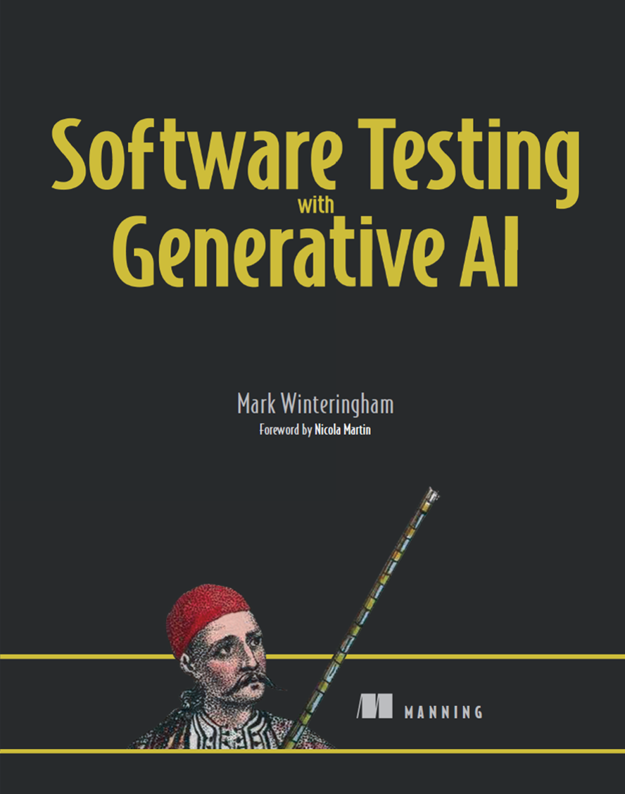
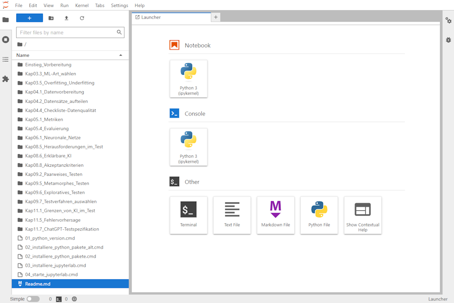

# Tool Pages for Generating Software Tests
## Fuzzing {#sec-fuzzing}

The [Fuzzing Book](https://www.fuzzingbook.org/) is a great resource for learning about fuzzing. It provides a comprehensive introduction to fuzzing, including the different types of fuzzing, how to create fuzzers, and how to use fuzzers to find bugs in software. The book also includes a number of exercises that allow you to practice fuzzing techniques and apply them to real-world software. Fuzzing can be done e.g. with metamorphic testing (@sec-metamorphic-testing), mutation testing (@sec-mutation-testing), and property-based testing (@sec-property-based-testing).

[BASFuzz](https://github.com/lumos0514/BASFuzz) is a fuzzing framework that is designed to be easy to use and extend. It provides a simple interface for creating fuzzers and running them against software. BASFuzz also includes a number of built-in fuzzers that can be used to find bugs in software.

The BASFuzz Workflow is a step-by-step guide to using BASFuzz to find bugs in software. It includes instructions for setting up BASFuzz, creating fuzzers, and running fuzzers against oftware. The workflow also includes tips and best practices for using BASFuzz effectively. 

The figure above shows an example of a robustness flaw found by BASFuzz. In a contract translation scenario, subtly perturbed input text (red) misleads the software, causing it to mistranslate a clause expressing permission to terminate the contract into an obligation to terminate. By using BASFuzz, developers and testerscan identify and fix these vulnerabilities before they can be exploited in the wild.

## Metamorphic Testing {#sec-metamorphic-testing}

[Metamorphic Testing](https://en.wikipedia.org/wiki/Metamorphic_testing) is a technique for testing software that is based on the idea of metamorphic relations. A metamorphic relation is a relationship between the inputs and outputs of a software system that can be used to generate new, so-called follow-up  test cases from existing ones. For example, if a software system is supposed to be invariant to the order of its inputs, then we can generate new test cases by permuting the order of the inputs. Metamorphic testing can be used to find bugs in software that are difficult to detect with traditional testing techniques, such as bugs that only occur under certain conditions or with certain inputs.

### LLMorph: Metamorphic Testing of Large Language Models {.unnumbered}

[LLMorph](https://github.com/steven-b-cho/llmorph) is a tool to automatically test Large Language Models (LLMs) using Metamorphic Testing (MT), thorough their use on Natural Language Processing (NLP) tasks. It leverages the property-based nature MT to uncover faulty behaviours without the need for expensive labelled data. LLMorph is aimed at researchers and developers who want to evaluate the robustness of LLM-based NLP systems.

## Mutation Testing {#sec-mutation-testing}

[Mutation Testing](https://en.wikipedia.org/wiki/Mutation_testing) is a technique for evaluating the effectiveness of software tests. It involves making small changes to the code (mutations) and then running the tests to see if they fail. If the tests fail, it indicates that the tests are effective at catching bugs. If the tests pass, it may indicate that the tests are not effective at catching certain types of bugs.

## Property-Based Testing {#sec-property-based-testing}

[Property-Based Testing](https://en.wikipedia.org/wiki/Property-based_testing) is a technique for testing software that is based on the idea of properties. A property is a statement about the behavior of a software system that should hold true for all inputs. For example, a property might be that a sorting algorithm should always return a sorted list. Property-based testing involves generating random inputs and checking that the properties hold true for those inputs. This can help to find bugs in software that are difficult to detect with traditional testing techniques.

# Exercises from the book "Software Testing with Generative AI" {.unnumbered}

[SW-testing-with-GenAI](https://github.com/mwinteringham/generative-ai-and-testing) is a repository that contains the exercises for the book ["**Software Testing with Generative AI**"](https://www.manning.com/books/software-testing-with-generative-ai). The repository includes Jupyter notebooks that provide hands-on exercises for testing software with generative AI techniques. The exercises cover a range of topics, including fuzzing, metamorphic testing, mutation testing, and property-based testing. The repository is designed to be used in conjunction with the book, and it provides a practical way for readers to apply the concepts and techniques discussed in the book to real-world software testing scenarios.

# German: Praktische Übungen zum Buch "KI-Testen" {.unnumbered}

Das Repository [KI-Übungen](https://github.com/KI-Testen/Uebungen/tree/main) enthält das Begleitmaterial und praktische Übungen zum Buch "[**Basiswissen KI-Testen** - Qualität von und mit KI-basierten Systemen](https://dpunkt.de/produkt/basiswissen-ki-testen/)" aus dem **dpunkt.Verlag**, ISBN 978-3-86490-947-4. Die Übungen sind so konzipiert, dass sie von jedem mit einem Laptop oder PC durchgeführt werden können, der über grundlegende Kenntnisse in Python und JupyterLab verfügt. 

Die folgenden Abschnitte sind eine 1:1 Kopie aus dem RTepository.

Um die Übungen selbst auf *deinem eigenen Laptop oder PC* durchführen zu können, benötigst du folgendes:
* Einen Laptop oder PC (ein Smartphone oder Tablet ist eher unpraktisch).
* Eine Installation von Python auf deinem Computer (sie [Punkt 2 unten](#2.-Installation-von-python)).
* Grundkenntnisse in der [Programmiersprache Python](https://tutorial.djangogirls.org/de/python_introduction)
* Grundkenntnisse in der [Benutzung von JupyterLab](https://jupyter-tutorial.readthedocs.io/de/latest/index.html)

## 1. Download des Übungsmaterials {.unnumbered}
* Lade von der GitHub-Seite [KI-Testen - Übungen](https://github.com/KI-Testen/Uebungen) das gesamte Repository als ZIP-Datei (Code (grüner Button) > Download ZIP)
* Entpacke die ZIP in ein Verzeichnis deiner Wahl.

## 2. Installation von Python, ML-Paketen und JupyterLab {.unnumbered}
* Als erstes musst du, wenn nicht schon vorhanden, [Python installieren](Einstieg_Vorbereitung/Installation_Python.md).
* Ist Python installiert, geht es mit der [Installation der Python-Pakete](Einstieg_Vorbereitung/Installation_Pakete.md) weiter
* Zum Schluss ist die [Installation von JupyterLab](Einstieg_Vorbereitung/Installation_JupyterLab.md) an der Reihe.

## 3. Los geht's: Starten von JupyterLab {.unnumbered}
Von nun ab kannst du JupyterLab per Doppelklick auf: 
`04_starte_jupyterlab.cmd` starten. Als erstes öffnet sich ein Kommandozeilenfenster mit dem Titel "JupyterLab Server".

Nach dem Start des CMD-Skriptes startet zudem dein Browser und öffnet eine Seite, die sich mit dem JupyterLab-Server (localhost:8888/lab/tree) verbindet, der im Kommandozeilenfenster läuft - lasse dieses also im Hintergrund weiter laufen!

Wenn du einen bestimmten Browser bevorzugst, kannst du die Datei `04_starte_jupyterlab.cmd` editieren und eine der drei per `::` auskommentierten Zeilen durch das Entfernen des `::` aktivieren und so deinen Lieblingsbrowser festlegen.

* *Diese* Anleitung (die du gerade liest) kannst du dir ansehen, wenn du mit der rechten Maustaste auf `Readme.md` klickst und *Open With > Markdown Preview* auswählst.

## 4. Mit den Aufgaben loslegen {.unnumbered}
*Hinweis:* Wir empfehlen dir, die Aufgaben nicht ohne eine gewisse Vorbereitung durch den entsprechenden Abschnitt im Buch zu beginnen.

*Außerdem:* Es ist gut, wenn du einfache Grundkenntnisse in Python als Programmiersprache mitbringst, und dich mit der Bedienung von **JupyterLab** und **Juypter Notebooks** schon etwas vertraut gemacht hast ([siehe oben](#Praktische-%C3%9Cbungen-zum-Buch-%22KI-Testen%22)).

Zum Bearbeiten einer Aufgabe - zum Beispiel zum Abschnitt 3.3:
* öffnest du in JupyterLab per Doppel-Click das Verzeichnis `Kap03.3_ML-Art-wählen` und
* öffnest das Notebook `Übung_...` ebenfalls per Doppel-Click.

und schon kann's losgehen!

## Lizenzbedingungen {.unnumbered}

**der Inhalte *dieses* GitHub-Repos (Notebooks, Grafiken, Code...):**

 
CC BY-NC-SA 4.0 (https://creativecommons.org/licenses/by-nc-sa/4.0/)

**der genutzten Werkzeuge und Daten:**

- pyhton: [PSF License](https://docs.python.org/3/license.html) - GPL-kompatibel
- jupyterlab: [BSD License](https://jupyterlab.readthedocs.io/en/latest/api/index.html?highlight=license#md:license)
- iris dataset: [CC-BY 4.0, donated by R. A. Fisher](https://archive.ics.uci.edu/dataset/53/iris)
- tensorflow playground: [Apache License](https://github.com/tensorflow/playground/blob/master/LICENSE)
- lime: Copyright &copy; 2016, Marco Tulio Correia Ribeiro [BSD-2-Clause License](https://de.wikipedia.org/wiki/BSD-Lizenz)
- shap: Copyright &copy; 2018, Scott Lundberg [MIT License](https://en.wikipedia.org/wiki/MIT_License)
- pict: Copyright &copy; Microsoft Corporation [MIT License](https://en.wikipedia.org/wiki/MIT_License)
- chatGPT: OpenAI [Terms of Use](https://openai.com/policies/terms-of-use)
- [OpenML](http://creativecommons.org/licenses/by/4.0/) [sowie BSD-3](https://opensource.org/licenses/BSD-3-Clause)